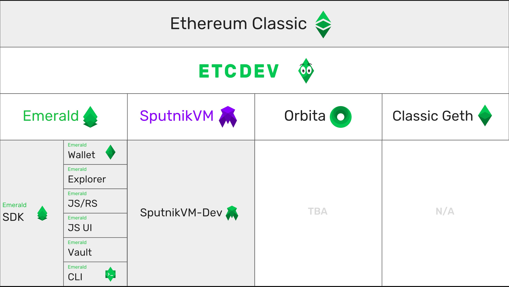

# Emerald

## Overview of Emerald Tools

### Emerald Wallet

The Emerald Wallet is an ETC desktop wallet allowing users to manage ETC, Tokens, and Accounts.

Capabilities: 

**Accounts**

* Generate new ETC account
* Import ETC account via keystore, private key, and ledger nano-s
* Backup ETC account via keystore, private key, and paper wallet
* Create and sign transactions

**Tokens**

* Import token by address

**Network**

* Select network nodes \(test-net/ main-net\)
* Select full node or light node

### Emerald Explorer

The Emerald Explorer is a light weight block explorer that can toggle between network nodes without having to download & sync an entire new chain.

### Emerald JS/ RS

Emerald JS is a Javascript JSON/RPC API for compatible with ETC and ETH. The API is available in Rust also.

### Emerald JS UI

Emerald JS UI is a highly modular and customizable library of already built UI components 

### Emerald Vault

Emerald Vault is an ETC account storage API that stores accounts, keys, and works offline.

### Emerald CLI

_The Swiss Army Knife_ of the Emerald SDK, encapsulating all the best Emerald tools with smart contract testing and deployment capabilities.

