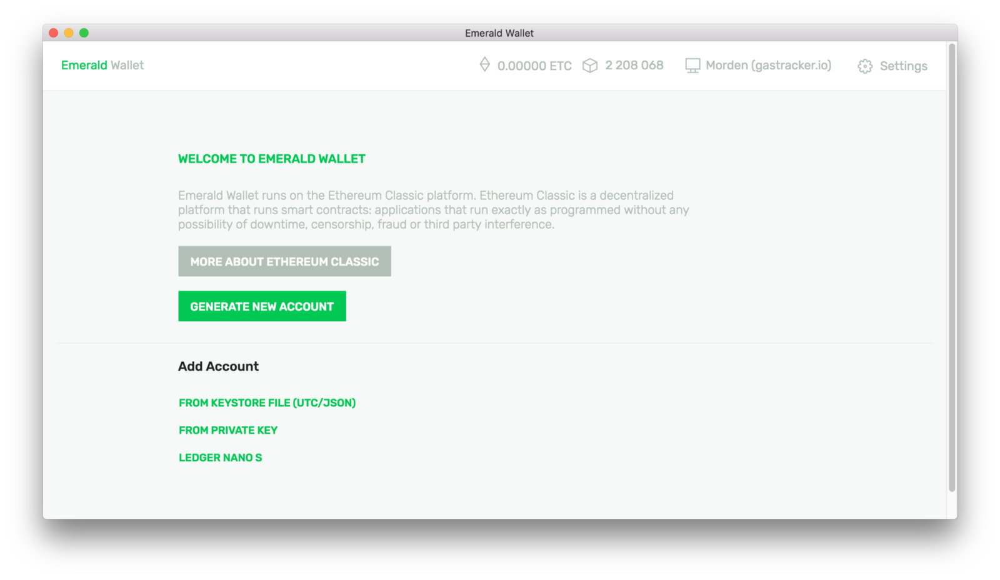
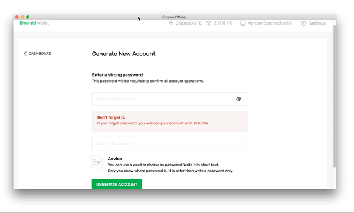
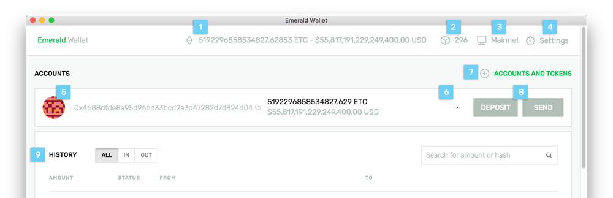
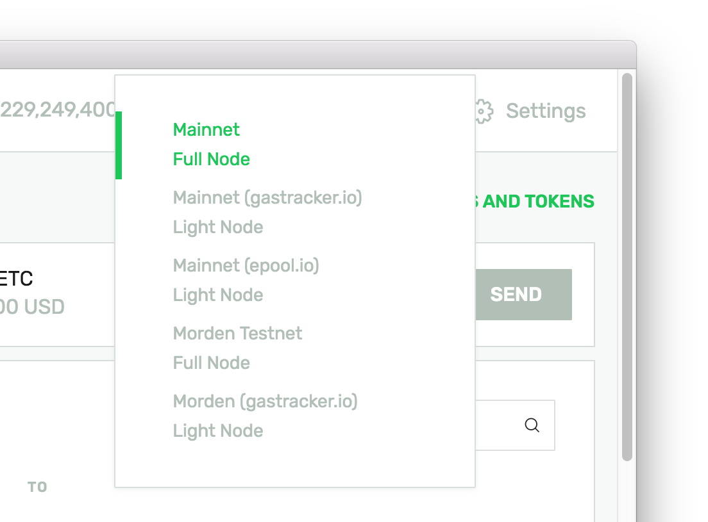
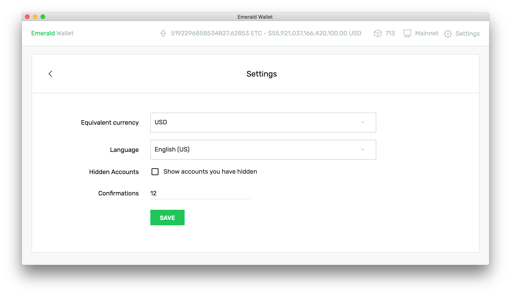
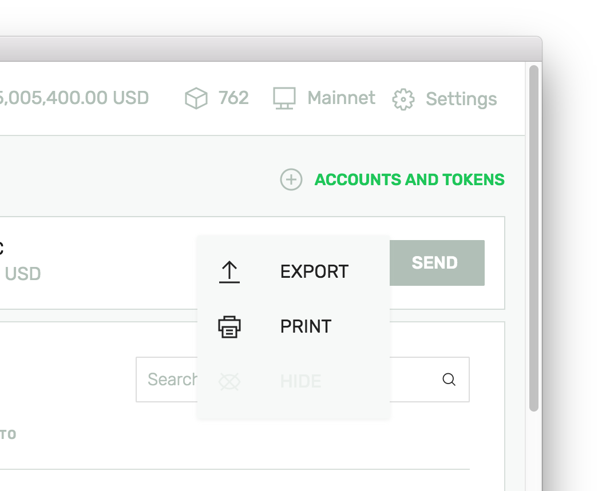
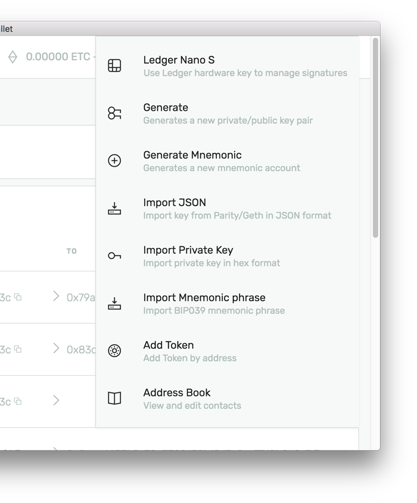
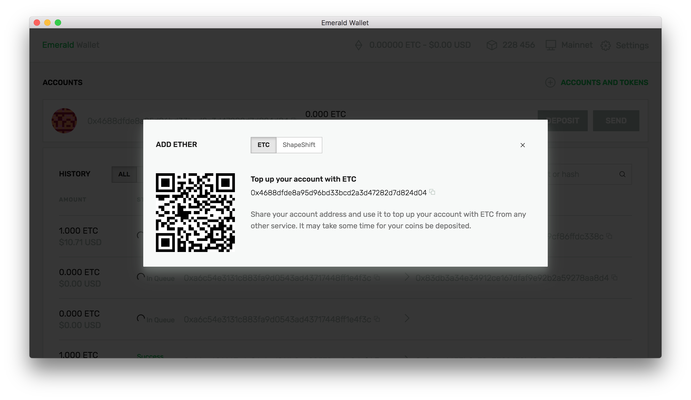
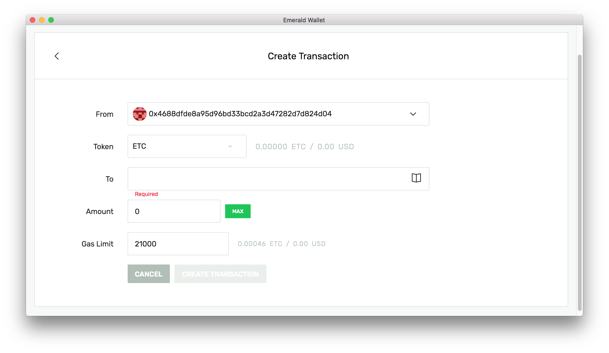

# Emerald Wallet

**GitHub** [https://github.com/ETCDEVTeam/emerald-wallet/releases](https://github.com/ETCDEVTeam/emerald-wallet/releases)

## Install

Download and install the latest release of the Emerald Wallet for your operating system from [https://github.com/ETCDEVTeam/emerald-wallet/releases](https://github.com/ETCDEVTeam/emerald-wallet/releases)

## Usage

### Welcome

Upon first opening the Emerald Wallet application, users have an option to _generate a new ETC account_ **or** _add an existing ETC account_ using **keystore file**, **private key**, and **ledger nano s**.

When generating or adding an ETC account, Emerald Wallet will require a password. This password will be used to sign transactions on behalf of that _particular_ account. 


Always backup **keystore files** and **private keys** for ETC accounts. ****Store them in a safe place.


### Overview

1. **Accounts' Value**
2. Current **block height** of network
3. **Node selection** \(full node, light node, test net node\)
4. **Settings** \(currency, language, hidden accounts, confirmations\)
5. **Account info**
6. **Account export** \(paper wallet, private key\)
7. **Accounts and Tokens** \(additional account and token options as well as _address book_\)
8. **Deposit and Send** buttons \(ETC or Tokens\)
9. **Transaction history**

### Node Selection

Emerald Wallet will download and sync a **Full Node** by default. This could take longer than desired for some users. To use a **Light Node**, use the node selector.

### Settings 

The settings menu allows a user to change the equivalent fiat currency in the App Bar, change language, show hidden accounts, and set transaction confirmation preference.

### Account Export

The account export button, `• • •`, allows a user to export a backup of their wallet. Users may choose to **Hide** the account. Any hidden accounts can be set to show by visiting **Settings**.

### Accounts and Tokens

The `+ Accounts and Tokens` menu allows a user a variety of account import options as well as adding a token by address. Many users may appreciate the **Address Book** feature 😊. 

### Deposit and Send

Following an account's info is the **deposit** and **send** buttons enabling a user to receive and send value.

### Transaction History

Transactions associated with the wallet's accounts are shown in the transaction history as well as confirmation status.


If running a **Full Node,** history may not show until node is synced to current block height.


