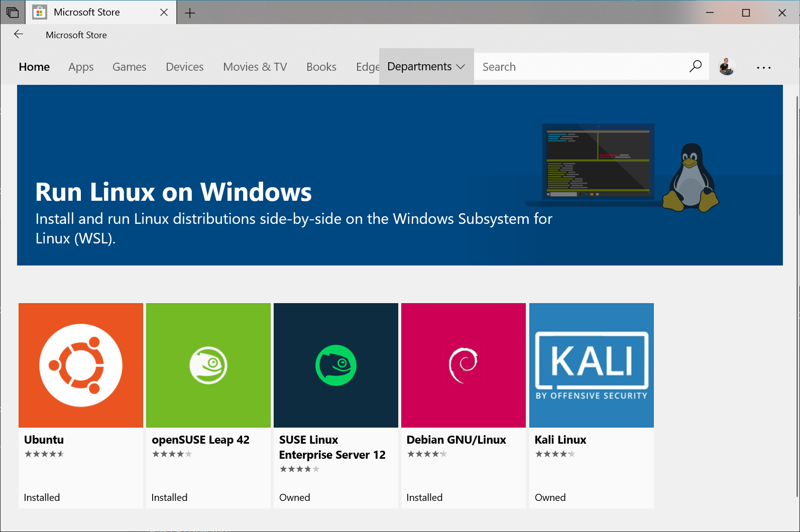

# Getting Started

## Get Emerald CLI

### Dependencies

* ​[Homebrew](https://brew.sh/) \(for macOS users\)
* Virtual Machine or Enable Subsystem for Linux WSL \(for Windows users\)
  * [VirtualBox ](https://www.virtualbox.org/)& a Linux image:
    * [Ubuntu](https://www.ubuntu.com/), [Linux Mint](https://linuxmint.com/), etc...
* a NodeJS version manager
  * ​[nodenv](https://github.com/nodenv/nodenv) & [node-build](https://github.com/nodenv/node-build#readme) or:
  * [nvm](https://github.com/creationix/nvm)


We recommend installing node.js via a node.js version manager. If you have node.js & npm already installed on your operating system, then remove them completely before reinstalling node with a node.js manager. If you have a node manager installed, such as nodenv or nvm, then you can move onto [installing the emerald cli](../emerald-platform/emerald-cli/install.md#installing-emerald-cli).




Install nodenv and node-build using homebrew. 

```text
$ brew install nodenv
$ brew install node-build
```

Confirm nodenv and node-build are installed

```text
$ nodenv -v
nodenv 1.1.2
$ node-build --version
node-build 3.0.18
```

Install _stable_ node version using `nodenv install <version>` and make global using `nodenv global 8.11.1`

```text
$ nodenv install 8.11.1
$ nodenv global 8.11.1
```

Then initialize nodenv.

```text
$ nodenv init
```

You may be prompted to add or append `.bash_profile`

```text
$ nodenv init
# Load nodenv automatically by appending
# the follow to ~/.bash_profile:

eval "$(nodenv init -)"
```

Simply add  `eval "$(nodenv init -)"` to .`bash_profile` or create a `.bash_profile` if one does not exist already. Finally, run `nodenv init` when `.bash_profile` has been appended.

Confirm node directory. `Node` and `NPM` should be ready to use now.

```text
$ which node
/Users/JohnSmith/.nodenv/shims/node
```


**Dependencies Installed**

Now that node and npm are installed via a node.js package manager, move onto the [Install](../emerald-platform/emerald-cli/install.md#installing-emerald-cli) of the Emerald CLI.





Do not install node.js with `apt-get`on Ubuntu. If you installed node.js with the built in package manager, then remove it 

`sudo apt-get purge nodejs && sudo apt-get autoremove && sudo apt-get autoclean`


Installing nvm

```text
$ curl -o- https://raw.githubusercontent.com/creationix/nvm/v0.33.11/install.sh | bash 
```

Confirm nvm installation

```text
$ nvm --version
```

Run the following command to increase the amount of inotify watches.

```text
echo fs.inotify.max_user_watches=524288 | sudo tee -a /etc/sysctl.conf && sudo sysctl -p
```

Install _stable_ node version

```text
$ nvm install 10.11.0
```

Setup node version as the default

```text
$ nvm use 10.11.0
$ nvm alias default 10.11.0
```

Confirm node version

```text
$ node -v
v10.11.0
```

Update npm version

```text
$ npm install -g npm
```

Confirm node version

```text
$ npm -v
6.4.1
```


**Dependencies Installed**

Now that node and npm are installed via a node.js package manager, move onto the [Install](../emerald-platform/emerald-cli/install.md#installing-emerald-cli) of the Emerald CLI.




**Option 1 - Using a Linux VM**

Windows users can install a Virtual Machine running Linux. Generally users need a Linux image \(.iso\) to install the operating system to their VM software.

1. Download and install a Linux image from [Ubuntu ](https://www.ubuntu.com/)or any other Linux distribution supported by your desired VM software.
2. Download and install [VirtualBox](https://www.virtualbox.org/) or your desired VM software.
3. Launch the VM and start your Virtual Machine. You may be prompted to use the Linux image \(.iso\) to complete the installation.

**Option 2 - Enabling Windows Subsystem for Linux**


[https://docs.microsoft.com/en-us/windows/wsl/install-win10](https://docs.microsoft.com/en-us/windows/wsl/install-win10)


**Install the Windows Subsystem for Linux \(WSL\)**

Windows Features &gt; \(switch on\) Windows Subsystem for Linux, 

or

Open PowerShell as Administrator and run:

`Enable-WindowsOptionalFeature -Online -FeatureName Microsoft-Windows-Subsystem-Linux`

**Install Linux Distribution of Choice**

Download and install from the Windows Store



From Distro page select Get


**Complete Initialization of Your Distro**

First initializing bash would prompt to create user and password which doesn't effect native Windows user.


Default distro data location: C:\Users\$HOME\AppData\Local\Packages\CanonicalGroupLimited.Ubuntu18.04onWindows\_79rhkp1fndgsc\LocalState\rootfs



If Linux VM or Linux distro is successfully setup, then follow Linux instructions to complete installing dependencies.




### Install Emerald CLI



Install Emerald CLI

```text
$ brew install libgcrypt
$ npm install -g https://github.com/ETCDEVTeam/emerald.git
```

This process may take a few minutes. When it's done, Emerald will be installed globally. Open a new terminal window and run `emerald -h` to view commands and options.

```text
$ emerald -h

   emerald 0.0.2 

   USAGE

     emerald <command> [options]

   COMMANDS

     new                 Create a new project               
     testrpc             Run testnet for ethereum classic   
     wallet              Boot Emerald Wallet                
     explorer            Boot Explorer                      
     deploy              Deploy solidity to network         
     help <command>      Display help for a specific command

   GLOBAL OPTIONS

     -h, --help         Display help                                      
     -V, --version      Display version                                   
     --no-color         Disable colors                                    
     --quiet            Quiet mode - only displays warn and error messages
     -v, --verbose      Verbose mode - will also output debug messages
```


If emerald commands return nothing, then **nodenv** may simply need to rehash. 

`$ nodenv rehash`


Updating Emerald CLI

```text
$ brew upgrade libgcrypt
$ npm install -g https://github.com/ETCDEVTeam/emerald.git
```



